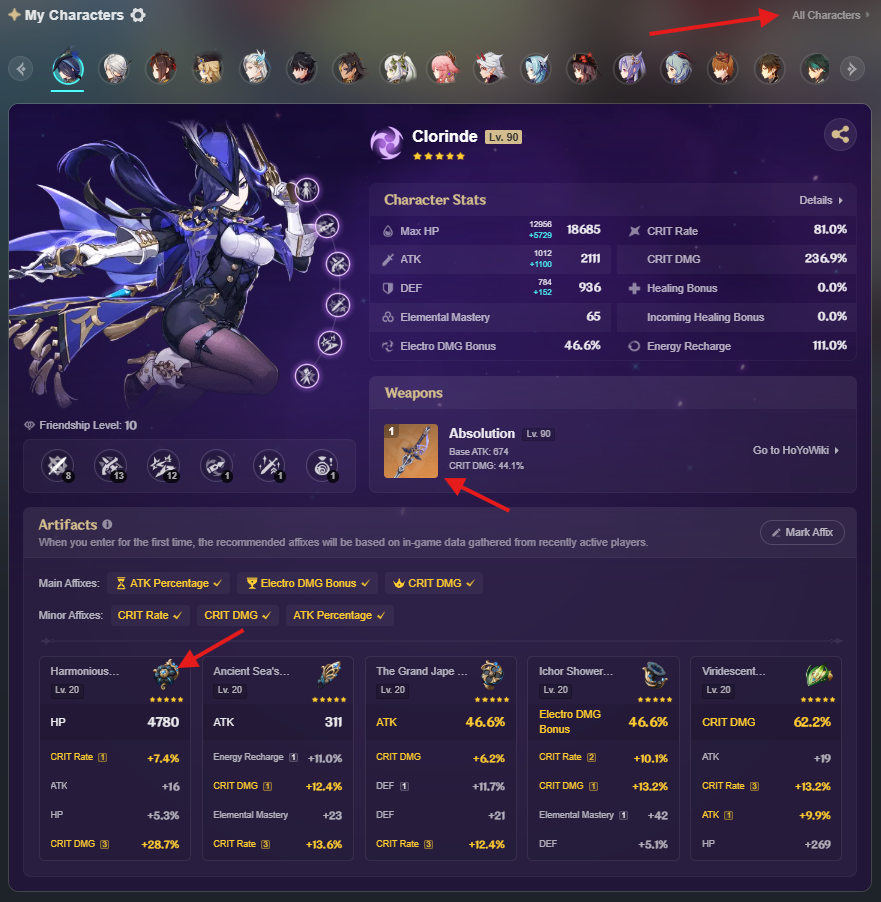
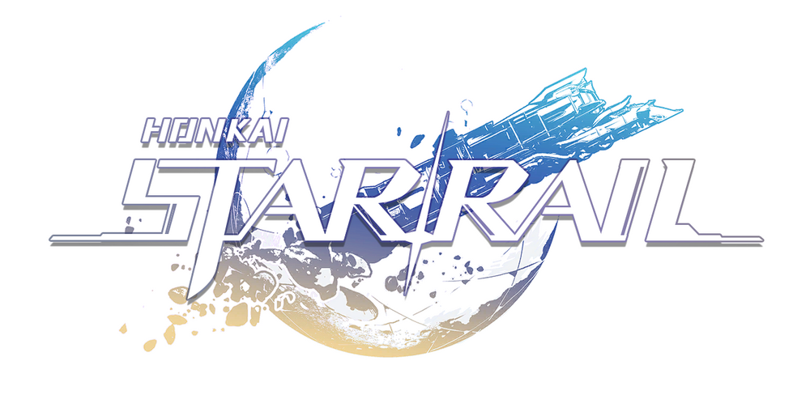
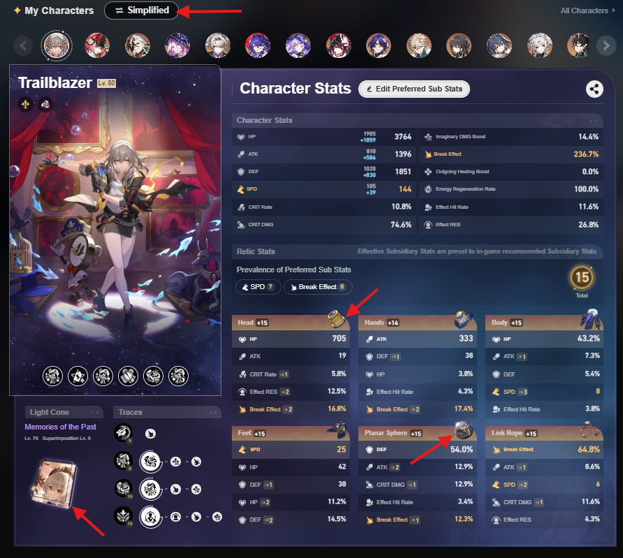
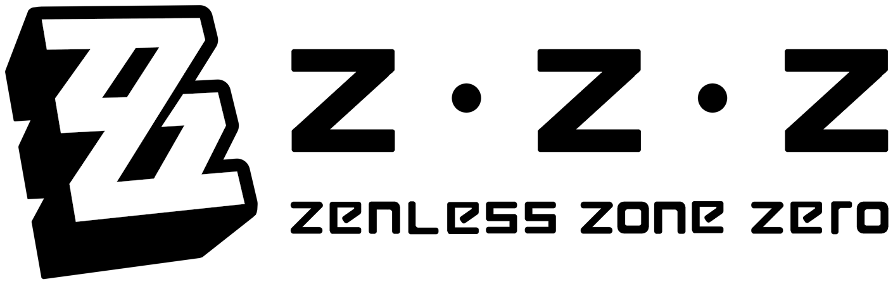
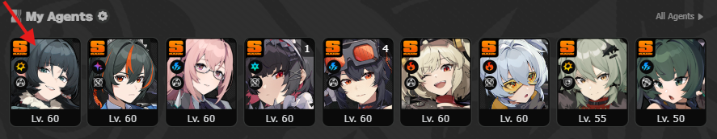

## Helper Links

- Characters : [Hoyolab](https://www.hoyolab.com/accountCenter/postList?id=17195645)
  - Open & download image from "All characters" page
- Weapons : [Hoyolab](https://www.hoyolab.com/accountCenter/postList?id=17195645)
  - Open & download image from a character's details
- Sets : [Hoyolab](https://www.hoyolab.com/accountCenter/postList?id=17195645)
  - Open & download image from a character's details

---

- Characters : [Hoyolab](https://www.hoyolab.com/accountCenter/postList?id=17195645)
  - Open & download image from "Simplified" view
  - Crop using Windows Paint to be 160x160
- Weapons : [Hoyolab](https://www.hoyolab.com/accountCenter/postList?id=17195645)
  - Open & download image from a character's details
- Sets : [Hoyolab](https://www.hoyolab.com/accountCenter/postList?id=17195645)
  - Open & download image from a character's details

---

- Characters : [Hoyolab](https://www.hoyolab.com/accountCenter/postList?id=17195645)
  - Open & download image from a character's "Wiki" page
  - Crop using [ILoveImg](https://www.iloveimg.com/crop-image)
    - Sizes around 256px~330px
- Weapons : [Hoyolab](https://www.hoyolab.com/accountCenter/postList?id=17195645)
  - Open & download image from a character's details
- Sets : [Wiki Fandom](https://zenless-zone-zero.fandom.com/wiki/Drive_Disc)
  - Open image & change parameter in url (50) to 256, then download

 
 
 

## TODO

> Add character notes ?
- use when...
- equip weapon/set when...
- etc.
