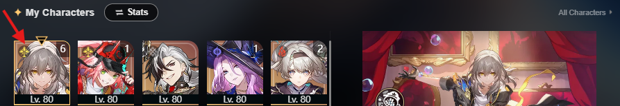
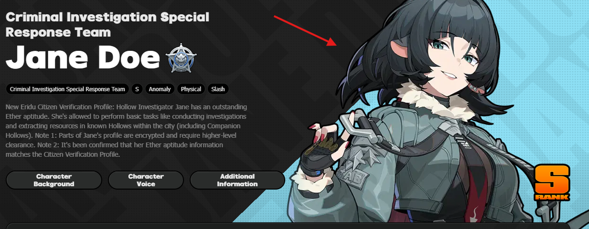

## Helper Links

> Genshin Impact
- Characters : [Wiki Fandom](https://genshin-impact.fandom.com/wiki/Character/List)
- Weapons : [Wiki Fandom](https://genshin-impact.fandom.com/wiki/Weapon/List)
- Sets : [Wiki Fandom](https://genshin-impact.fandom.com/wiki/Artifact/Sets)
  - Open image & change url path variable (50) to 256 then download

> Honkai Star Rail
- Characters : [Hoyolab](https://www.hoyolab.com/accountCenter/postList?id=17195645)
  - Open & download character icon image (Simplified or Stats view)
      
  - Crop using Windows Paint to be 160x160
- Weapons : [Hoyolab](https://www.hoyolab.com/accountCenter/postList?id=17195645)
- Sets : [Hoyolab](https://www.hoyolab.com/accountCenter/postList?id=17195645)

> Zenless Zone Zero
- Characters : [Hoyolab](https://www.hoyolab.com/accountCenter/postList?id=17195645)
  - Select character
     
  - Open wiki
     
  - Download image
     
  - Crop using [ILoveImg](https://www.iloveimg.com/crop-image)
  - Sizes around 256px~330px
- Weapons : [Hoyolab](https://www.hoyolab.com/accountCenter/postList?id=17195645)
- Sets : [Prydwen](https://www.prydwen.gg/zenless/disk-drives)

 
 
 

## TODO

> Add game notes
- Meaning of rotations shortcut (B: Basic)
- etc.

> Add team notes
- Character weapon in a team
- Simple rotation notes
- etc.